# Day 2: IAM & Service Accounts in GCP

## Objective

Secure GCP resources using IAM roles, policies, and service accounts, following best practices for access control and least privilege.

---

## Tasks Completed

### Task 1. Created custom IAM roles and assigned them to test users

#### Creating the Custom Role
- Created a custom role named `ComputeViewer`
  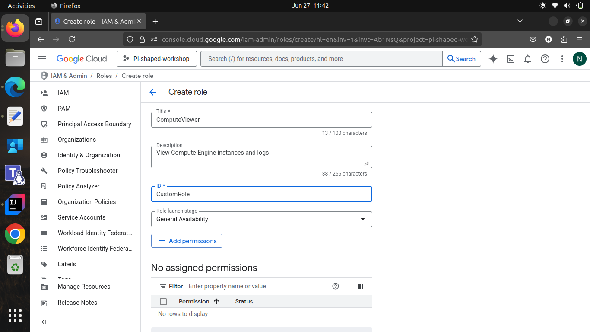
- Added the following role permissions
  ```bash
  compute.address.get: View details of a specific static or ephemeral IP address in Compute Engine.
  compute.address.list: List all static or ephemeral IP addresses in a project.
  compute.instances.get: View details of a specific VM instance in Compute Engine.
  compute.instances.list: List all VM instances in a project.
  logging.logEntries.list: View log entries in Cloud Logging.
  resourcemanager.projects.get: View metadata about a specific GCP project
  ```
  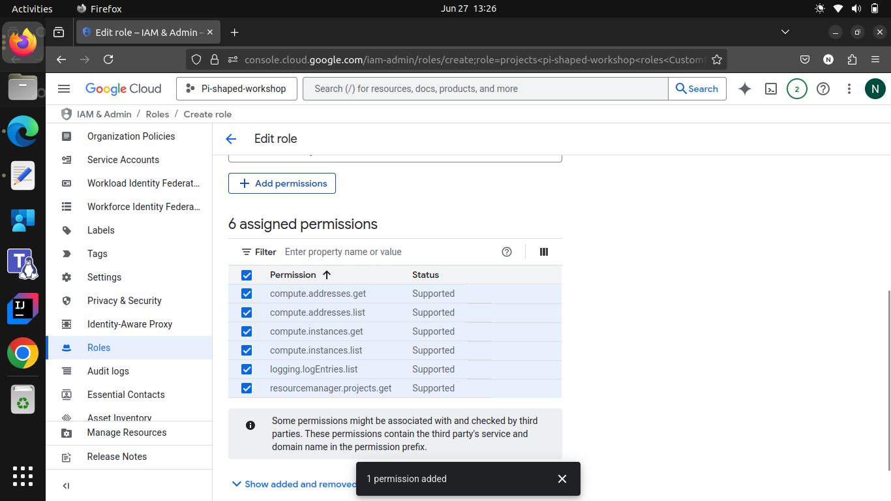
- Custom role creation success
  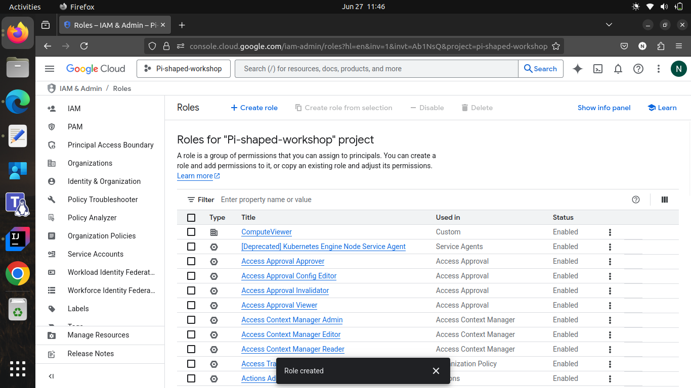

#### Creating the new IAM policy
- Created a new IAM allow policy to grant the custom role to a test user: **tv18072000@gmail.com**
  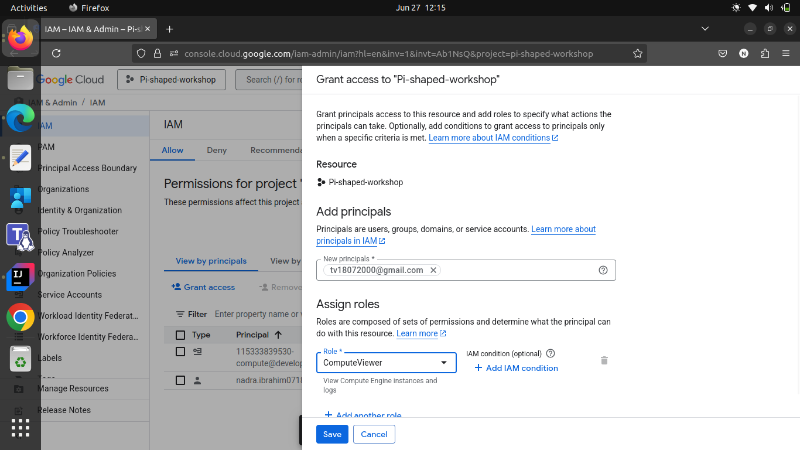
- Adding the test user to the policy
  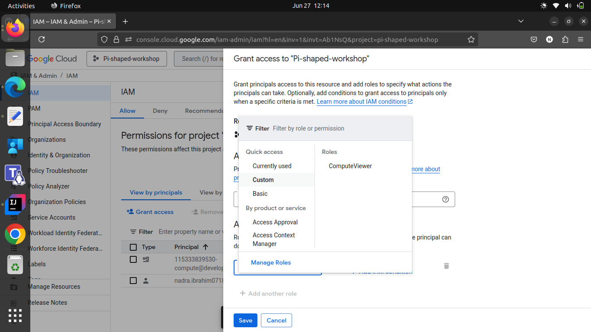
- New IAM policy creation success
  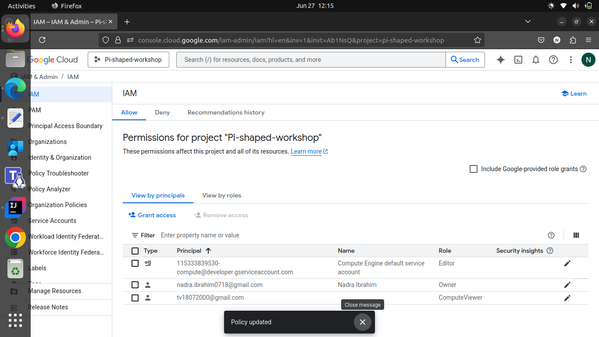

#### Testing the Custom Role
- Verified the test user: **tv18072000@gmail.com** can view VM instances but not modify them
  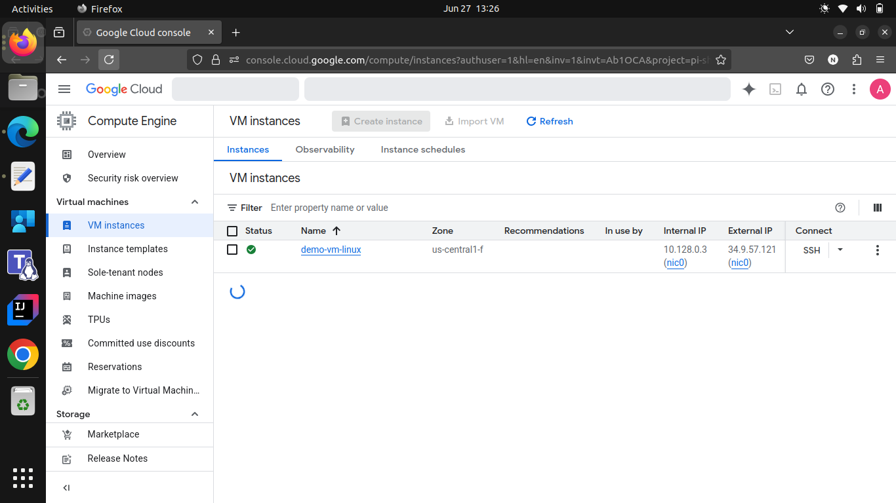
- Ensured the user cannot access other GCP resources outside the Compute Engine scope
  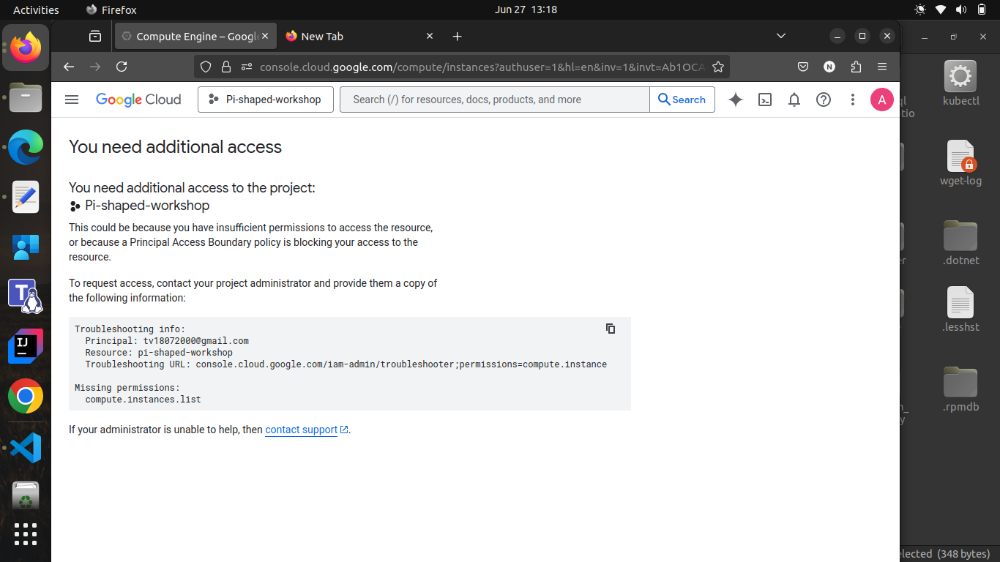

---

### Task 2. Created a service account for a Compute Engine VM and enforced least privilege

#### Creating the Service Account
- Created a service account named `vm-service-account`
  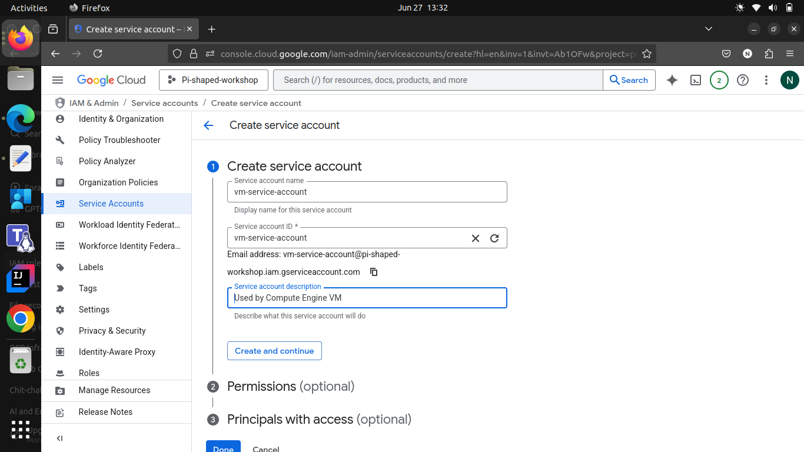
- Assigned the custom role `ComputeViewer` to the service account
  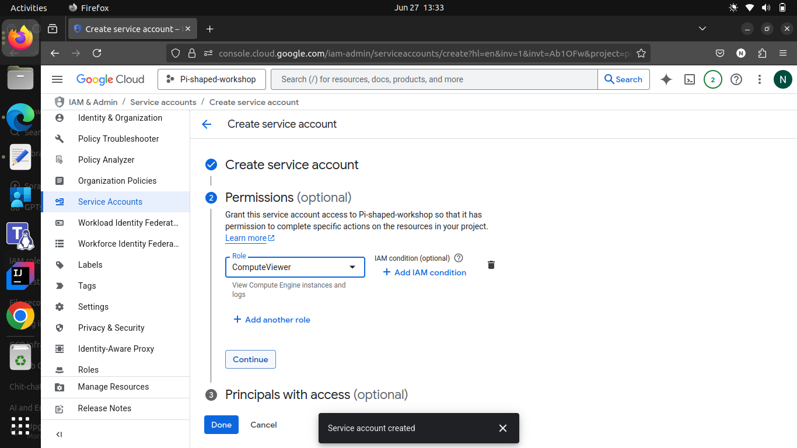
- Service account creation success
  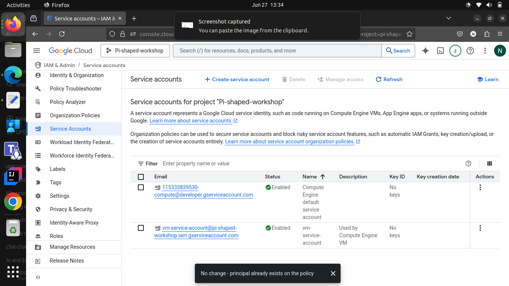

#### Attaching the Service Account to a VM
- Attached the service account to existing Compute Engine VM instance
  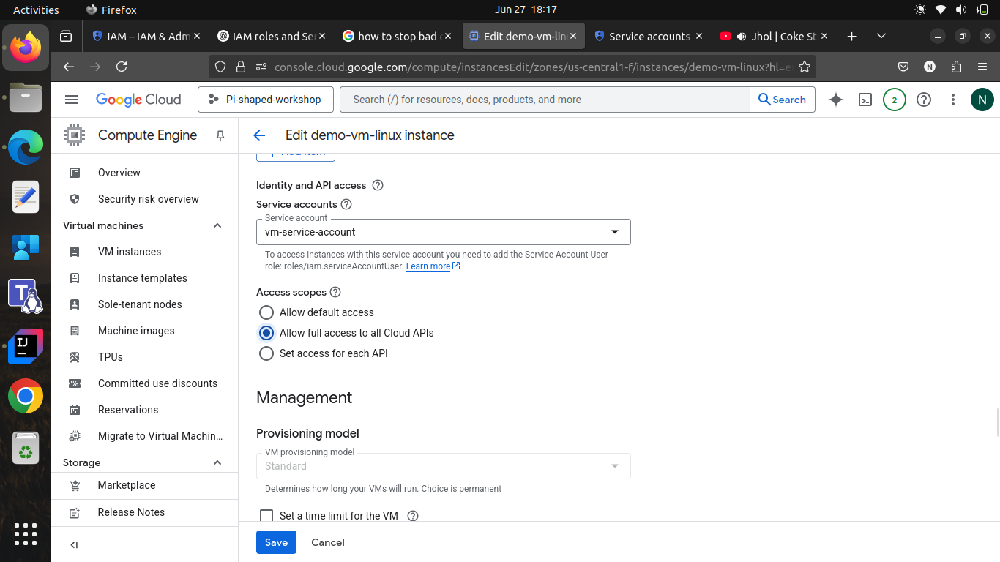
- Restarted the VM to apply the service account attachment
  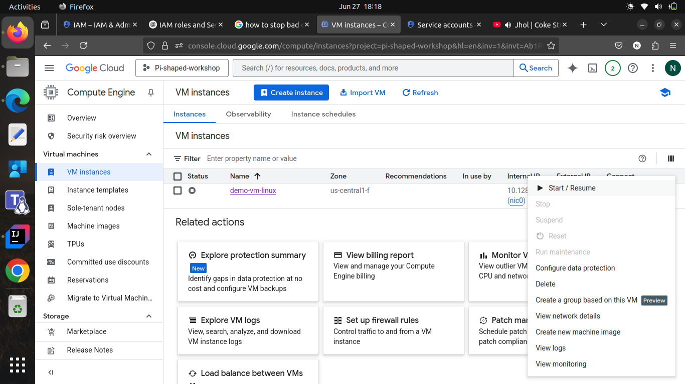
- Checked the attachment success through gcloud sdk.
  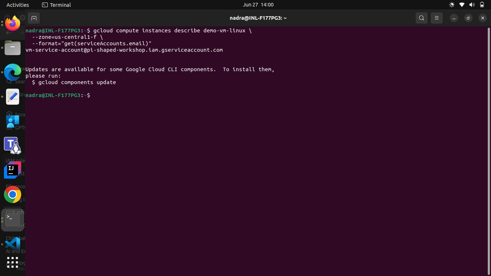

#### Testing the Service Account Access
- SSH into the VM                                                                 
  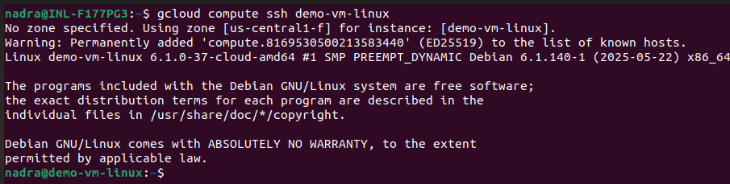
- Checked the service account attached to the VM using the metadata server.
  ```bash
  curl http://metadata.google.internal/computeMetadata/v1/instance/service-accounts/default/email -H "Metadata-Flavor: Google"
  ```
  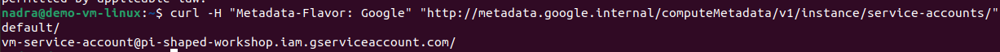
- Used the gcloud SDK to test specific permissions
  ```bash
  gcloud compute instances list
  ```
  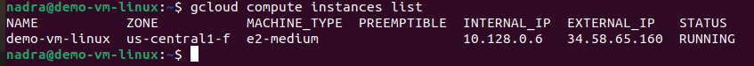
- Viewed the logs from the **GCP Log Explorer**
  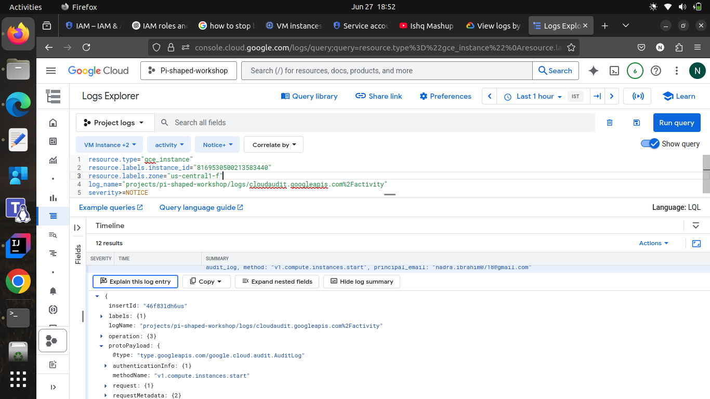
- Tested the service account's ability to view logs upto 2 records
  ```bash
  gcloud logging read \
    'resource.type="gce_instance" AND 
    resource.labels.instance_id="8169530500213583440" AND 
    resource.labels.zone="us-central1-f" AND 
    resource.labels.project_id="pi-shaped-workshop" AND 
    logName="projects/pi-shaped-workshop/logs/cloudaudit.googleapis.com%2Factivity" AND 
    severity="NOTICE"' \
    --limit=10 \
    --format=json
  ```
  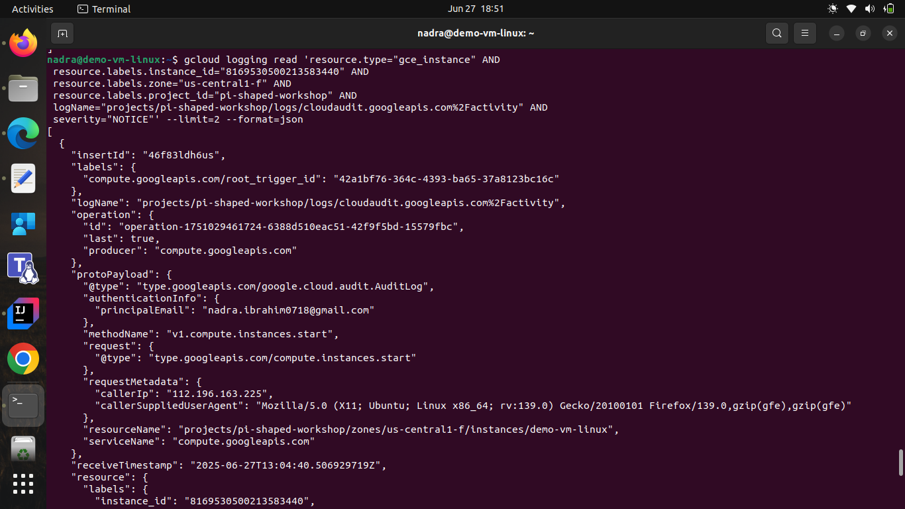

---

## Enforced the principle of the least privilege in role assignments
- Created a custom role with only the necessary permissions for viewing Compute Engine instances and the logs, to avoid over-privileging.
- Created an IAM policy that grants the custom role to a specific test user, ensuring they can only view VM instances without modification rights.
- Created a service account for a VM with restricted permissions, allowing it to interact with Compute Engine resources following the least privilege principle.
- Ensured that the service account could only perform actions necessary for its function, such as viewing logs and VM details.
- Ensured that the service account does not have access to other GCP services or resources, maintaining a strict scope of permissions.

---

## Documented the difference between primitive, predefined, and custom roles

### Primitive Roles
Primitive roles are broad roles that apply to all GCP services, such as Owner, Editor, and Viewer. They provide wide-ranging permissions and are not recommended for production use due to their excessive access.
### Predefined Roles
Predefined roles are roles created by Google that provide a set of permissions for specific services. They are more granular than primitive roles and are designed to cover common use cases while adhering to the principle of least privilege.
### Custom Roles
Custom roles are user-defined roles that allow you to specify a set of permissions tailored to your specific needs. They provide the flexibility to create roles with only the necessary permissions for a particular task or user, ensuring adherence to the principle of least privilege.
## Summary
This assignment focused on implementing IAM best practices in GCP by creating custom roles, assigning them to users and service accounts, and enforcing the principle of least privilege. The tasks included creating a custom role for viewing Compute Engine instances, assigning it to a test user, and creating a service account for a VM with restricted permissions. The goal was to ensure secure access control while preventing unauthorized modifications or access to other resources.

---

## Core Concept Questions

### 1. Why is it dangerous to assign Editor role to all users in a production environment?

The Editor role has broad permissions across all GCP services, which can lead to accidental or malicious modifications. It violates the principle of least privilege and increases security risks.

### 2. How do service accounts differ from user accounts in managing backend services?

Service accounts are non-human identities used by applications or VMs to interact with GCP APIs. Unlike user accounts, they don’t require login and can be tightly scoped with specific roles for automation and backend access.

### 3. What practices help secure IAM in a multi-project GCP setup?

- Use least privilege principle
- Assign roles at project or resource level, not organization-wide
- Avoid using primitive roles
- Audit IAM policies regularly
- Use separate service accounts per workload
- Enable 2FA and logging for user actions