# Day 3: Terraform for Basic Infrastructure Automation

## Objective
Automate provisioning of GCP resources using Terraform.

---

## Tasks

### Task 1. Install and configure Terraform CLI.
- Went to the [Hashicorp's Terraform download page](https://developer.hashicorp.com/terraform/tutorials/aws-get-started/install-cli).
  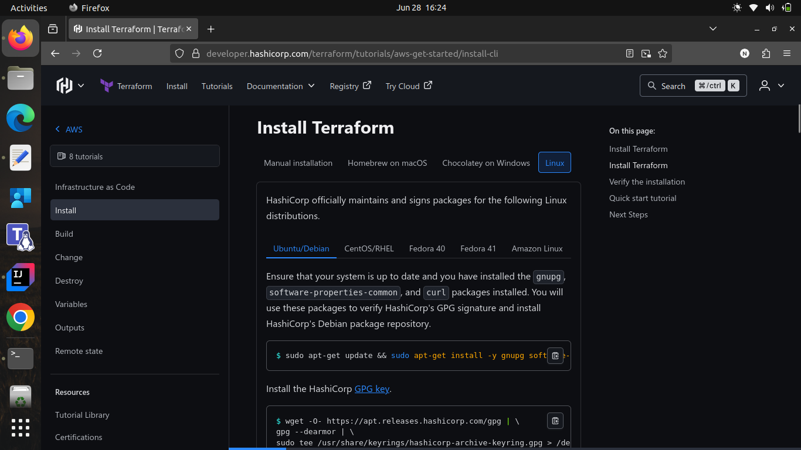
- Followed the instructions to install Terraform CLI on your system.
  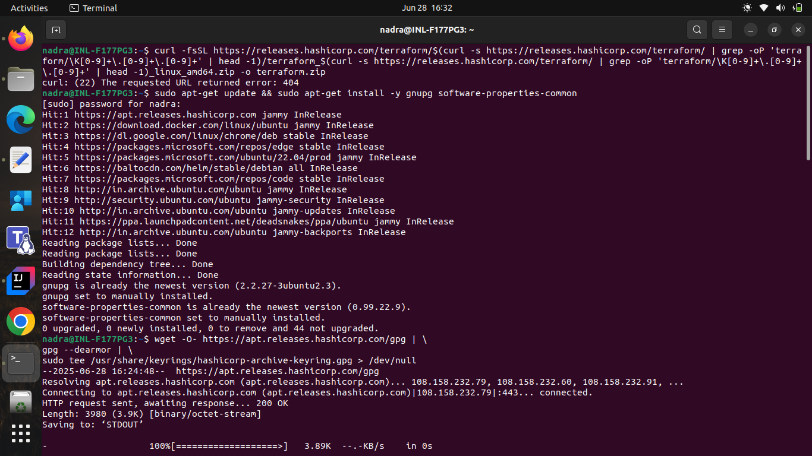
- Verified the installation by running:
  ```bash
  terraform -version
  ```
  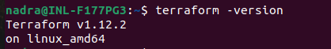
- Created a directory named `terraform-project` for the Terraform configuration files.
- Created an empty **main.tf** file in the new directory.
  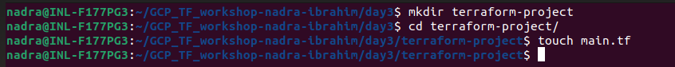
- Authenticated to Google cloud, using the command:
  ```bash
  gcloud auth application-default login
  ```
  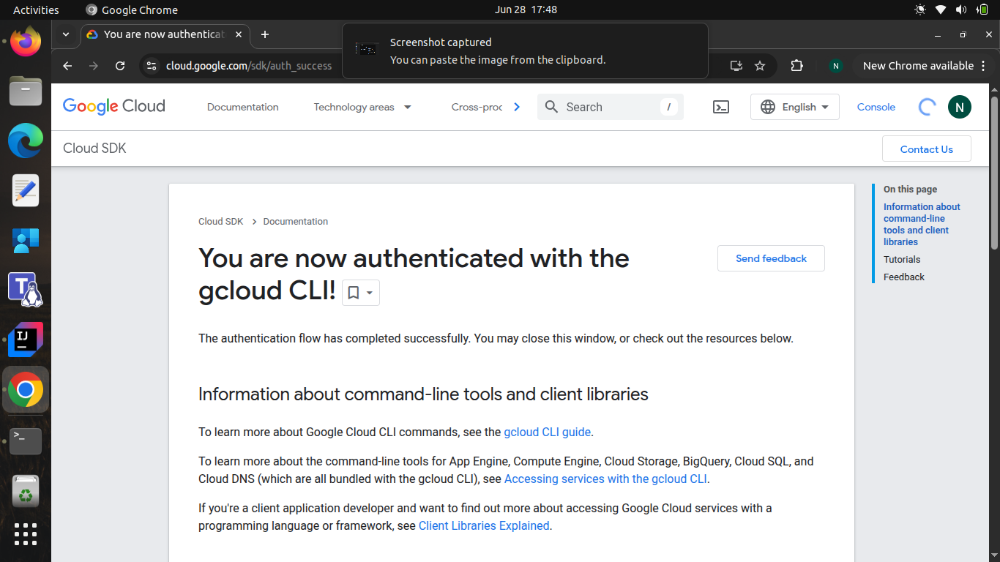
- Initialized the Terraform project directory using:
  ```bash
  terraform init
  ```
  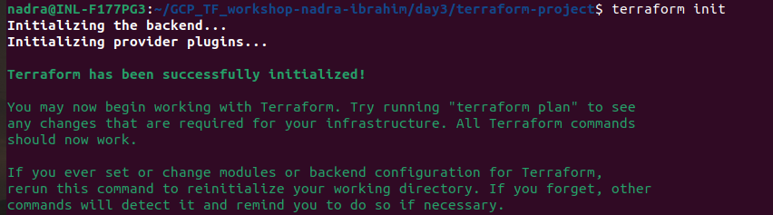

---

### Task 2. a. Write Terraform code to create a VM.

- Edited the **main.tf** file to include the configuration code for a Google Compute Engine VM instance.
- To make the initial dependency selections that will initialize the dependency lock file, run:
  ```bash
  terraform init
  ```
  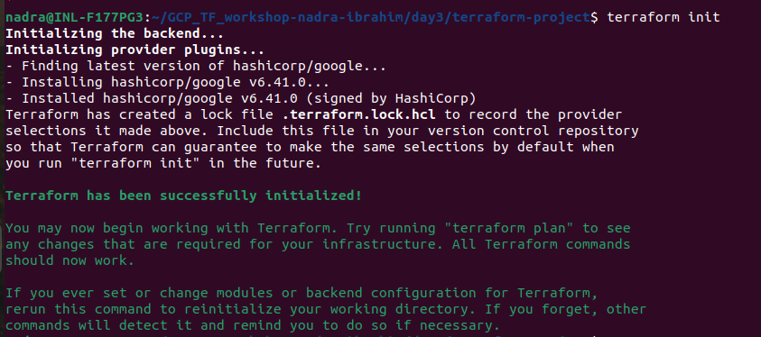
- Created the infrastructure using:
  ```bash
  terraform apply
  ```
  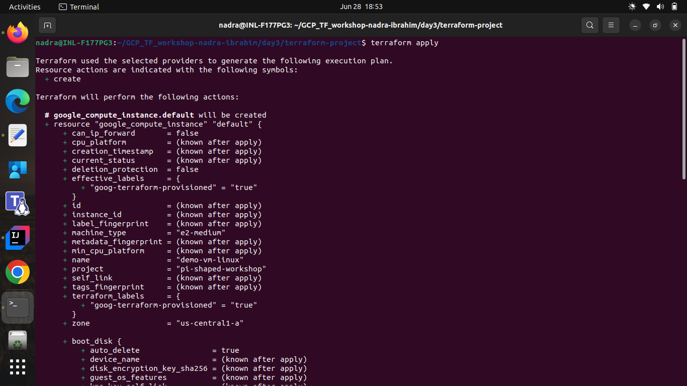
- Answered `yes` to confirm the creation of resources.
  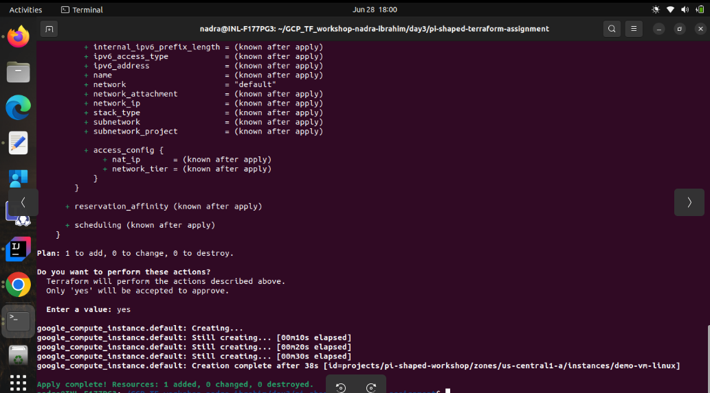
- Checked the created VM in the GCP Console.
  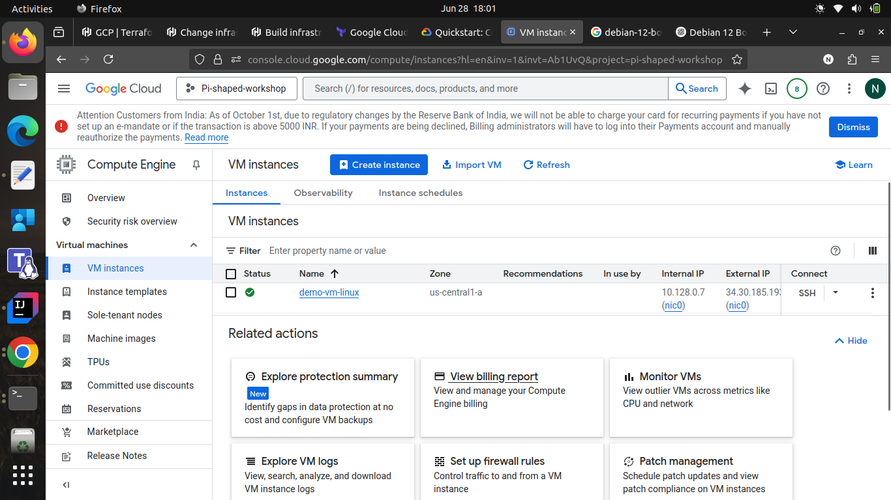

---

### Task 2. b. Write Terraform code to create a storage bucket.
- Edited the **main.tf** file to include the configuration code for a Google Cloud Storage bucket.
- Applied the changes using:
  ```bash
  terraform apply
  ```
  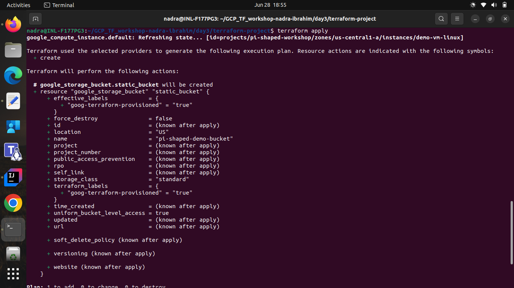
- Confirmed the creation of the bucket by typing `yes`.
  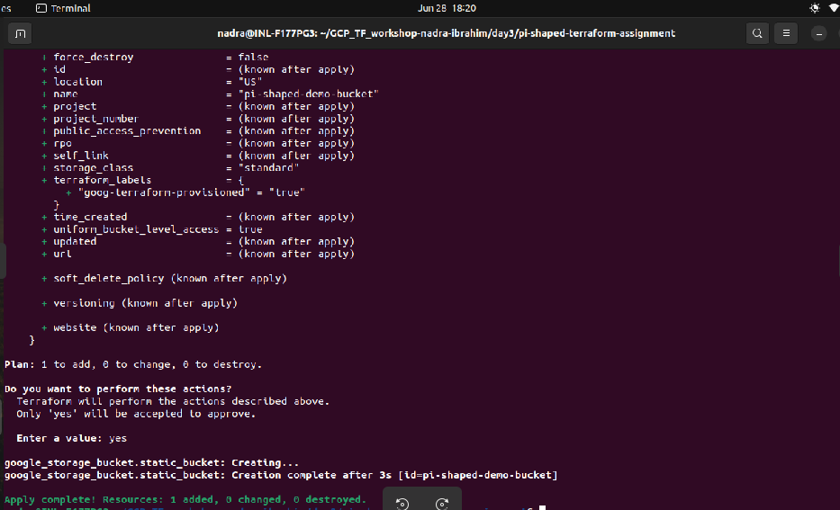
- Checked the created bucket in the GCP Console.
  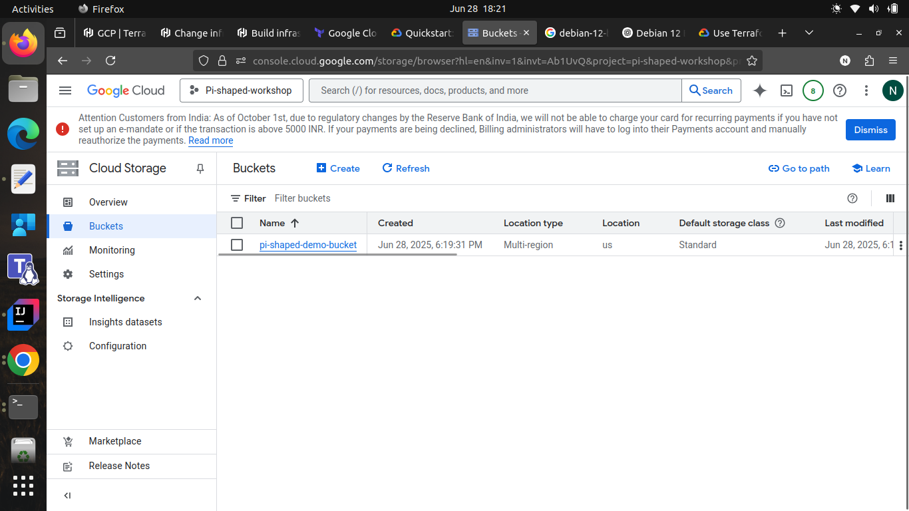

---

### Additional Task. Use input variables to parametrize the provider configuration.
- Created a **variables.tf** file to define input variables for the project ID, region and zone, leaving the project ID left unset (no default value provided).
- Updated the **main.tf** file to use these input variables.
- Applied the changes and is prompted to enter the value of the project ID as it is not defined in the **variables.tf** file.
  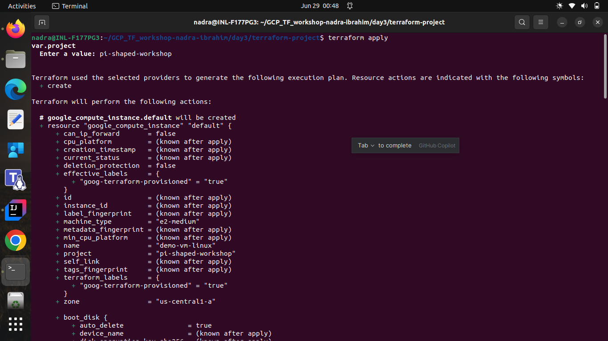
- Resources were created successfully with the provided project ID.
  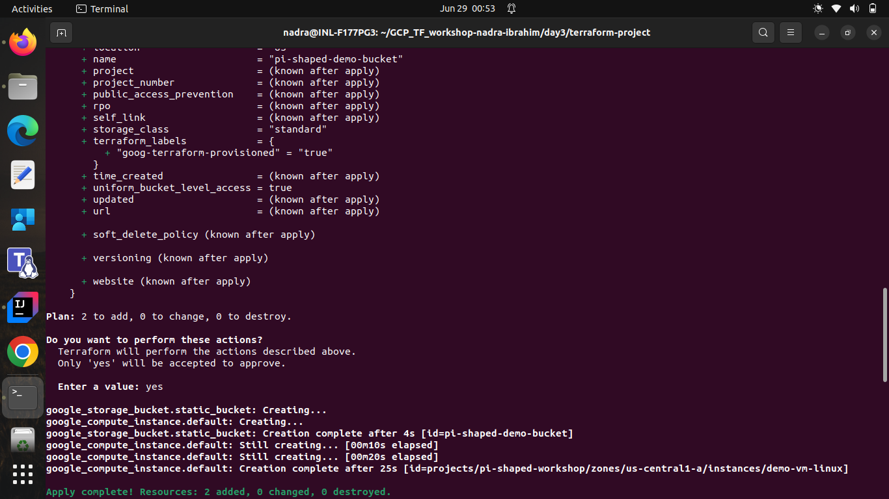

---

### Task 3. Use output variables to display Public IP and Bucket URL.
- Added the code in **outputs.tf** file to include output variables for the VM's public IP and the bucket URL.
- Applied the changes and the output variables were displayed after the successful creation of resources.
  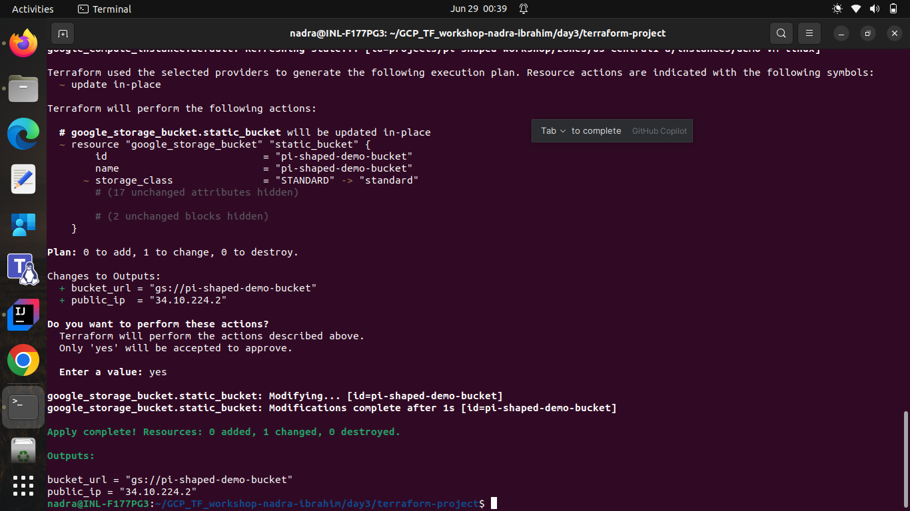

---

### Task 4. Store Terraform state locally and comment on its importance.
- By default, the Terraform state is stored in a local file named "terraform.tfstate" in the terraform project directory. But the hashicorp recommends stroring it in HCP Terraform Cloud or Terraform Enterprise for better collaboration and security.                    
  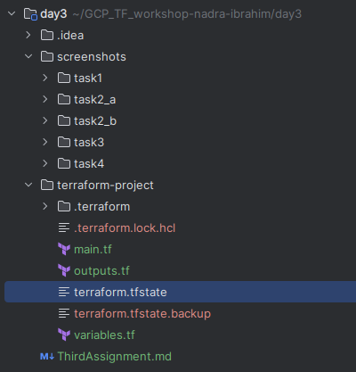


- **Importance of Terraform State**:
  - Terraform must store state about our managed infrastructure and configuration. This state is used by Terraform to map real world resources to our configuration, keep track of metadata, and to improve performance for large infrastructures.
  - Terraform uses state to determine which changes to make to our infrastructure. Prior to any operation, Terraform does a refresh to update the state with the real infrastructure.
  - The primary purpose of Terraform state is to store bindings between objects in a remote system and resource instances declared in our configuration. When Terraform creates a remote object in response to a change of configuration, it will record the identity of that remote object against a particular resource instance, and then potentially update or delete that object in response to future configuration changes.

---

## Destroy Resources
- To clean up the resources created during the tasks, run:
  ```bash
  terraform destroy
  ```
- Confirmed the destruction of resources by typing `yes`.
  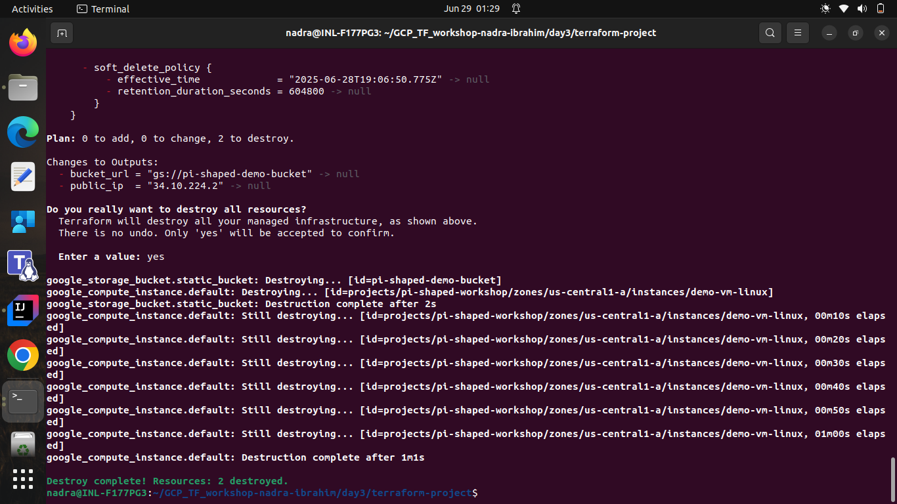

---

## Code Structure Explanatioon

```plaintext
terraform-project/
├── main.tf
├── variables.tf
├── outputs.tf
└── terraform.tfstate
```

- **terraform-project/**: The directory where all the Terraform configuration files and state files are stored.
- **main.tf**: Contains the main configuration for the resources to be created, such as the VM instance and storage bucket.
- **variables.tf**: Defines input variables for the project ID, region, and zone, allowing for parameterization of the Terraform configuration.
- **outputs.tf**: Contains output variables to display important information such as the public IP of the VM and the URL of the storage bucket.
- **terraform.tfstate**: The state file that Terraform uses to keep track of the resources it manages. It contains information about the current state of the infrastructure and is automatically generated by Terraform when resources are created or modified.

---

## Core Concept Questions (Add in README of repo)
### 1. What is the difference between declarative IaC and imperative scripting?
- **Declarative Infrastructure as Code (IaC)** focuses on defining the desired state of the infrastructure without specifying the steps to achieve that state. It allows users to describe what resources they want and their configurations, and the IaC tool (like Terraform) takes care of how to create or modify those resources to match the desired state.
- **Imperative scripting**, on the other hand, involves writing scripts that explicitly define the sequence of commands or steps to create or modify resources. It requires users to specify how to achieve the desired state, detailing each action to be performed in a specific order.

### 2. Why is Terraform state important and how can it become a security risk?
Terraform state is important because it keeps track of the resources managed by Terraform, allowing it to understand the current state of the infrastructure. It is used to map real-world resources to the configuration defined in Terraform files, enabling efficient resource management, change detection, and collaboration in a team environment.
However, it can become a security risk if it contains sensitive information (like access keys or passwords) and is not handled properly. If the state file is stored locally or in an insecure location, unauthorized users may gain access to sensitive data. To mitigate this risk, it is recommended to use remote state storage with proper access controls and encryption for production environments.

### 3. In what scenarios should a team use Terraform over manual provisioning?
Using Terraform over manual provisioning is beneficial in scenarios such as:
- **Infrastructure as Code**: When a team wants to manage infrastructure using code, allowing for version control, collaboration, and automation.
- **Reproducibility**: When there is a need to create consistent and reproducible environments across different stages (development, testing, production).
- **Resource Management**: When needing to manage resources across multiple cloud providers or services, Terraform provides a unified way to handle different resources in a consistent manner.
- **Automation**: When automating the provisioning and management of resources to reduce manual effort, minimize human errors, and improve efficiency in infrastructure management.
- **Scalability**: When managing large and complex infrastructures that require automation to handle multiple resources efficiently.
- **Collaboration**: When multiple team members need to work on the same infrastructure, Terraform provides a structured way to manage changes and avoid conflicts.
- **Change Management**: When there is a need to track changes over time, allowing for rollbacks and audits of infrastructure modifications.
- **Integration with CI/CD**: When integrating infrastructure management into continuous integration and deployment pipelines to automate the provisioning and management of resources as part of the software development lifecycle.
- **Cost Management**: When there is a need to optimize resource usage and costs by automating the provisioning and deprovisioning of resources based on demand.
- **Disaster Recovery**: When having a reliable way to recreate infrastructure in case of failures or disasters, allowing for quick recovery and minimal downtime.
- **Compliance**: When adhering to compliance requirements that mandate infrastructure to be managed and documented in a structured manner, ensuring traceability and accountability.

---