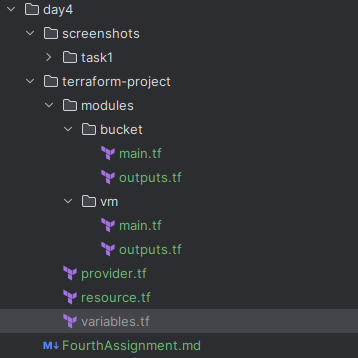
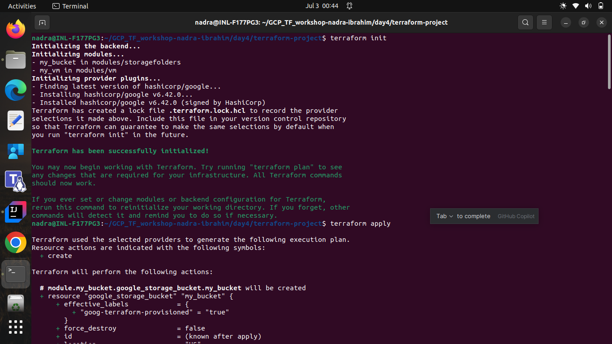
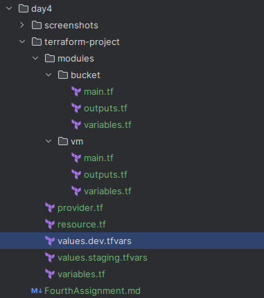

# Day 4: Advanced Terraform (Modules, Remote State, Workspaces)

## Objective
Modularize and manage Terraform configurations for scalability and collaboration.

---

## Tasks

### Task 0. Setup a Terraform project structure.
- Copied the previous day's Terraform project directory to a new directory named **terraform-project**.
- Split the **main.tf** file into two files: **provider.tf** and **resource.tf**.

---

### Task 1. Refactor previous code into a reusable module.
- Created a directory named `modules` to hold reusable Terraform modules inside the **terraform-project** directory.
- As per the previous code, there were two resources: a VM and a storage bucket. So removed the VM and storage bucket code from the root **resource.tf** file and deleted the **output.tf** file.
- Created two subdirectories: `vm` and `storagefolders` inside the `modules` directory.        
  
- Moved the VM configuration code into **modules/vm/main.tf** and the output code into **modules/vm/outputs.tf**.
```hcl
# modules/vm/main.tf
resource "google_compute_instance" "my_vm" {
  name         = "pi-shaped-demo-vm"
  zone         = "us-central1-a"
  machine_type = "e2-medium"

  boot_disk {
    initialize_params {
      image = "debian-12-bookworm-v20250610"
    }
  }

  network_interface {
    network = "default"
    access_config {}
  }
}
```
- Moved the storage bucket configuration code into **modules/bucket/main.tf** and the output code into **modules/bucket/outputs.tf**.
```hcl
# modules/bucket/main.tf
resource "google_storage_bucket" "my_bucket" {
  name         = "pi-shaped-demo-bucket"
  location     = "us"
  storage_class = "standard"
  uniform_bucket_level_access = true
}
```
- Updated the root **resource.tf** file to call these modules.
```hcl
module "my_vm" {
  source = "./modules/vm"
}

module "my_bucket" {
  source = "./modules/bucket"
}
```
- Run `terraform init` to initialize the modules.
- Run `terraform plan` to check the changes and ensure that the modules are correctly referenced.
  
- Run `terraform apply` to create the resources using the modules.
- Checked the GCP Console to verify that the VM and storage bucket were created successfully.

---

### Task 2. Setup backend for remote state (e.g., GCS bucket)..
- Created a GCS bucket named `terraform-state-bucket` to store the Terraform state file.
- Updated the **provider.tf** file to include the backend configuration for GCS.
- Pushed the Terraform state to the remote backend using the command `terraform init -migrate-state`.
- Verified that the state file was successfully stored in the GCS bucket by checking the GCP Console.
- Used the command `terraform state list` to view the resources managed by Terraform in the remote state.
- Ensured that the local state file was no longer present, confirming that the state is now managed remotely.

---

### Task 3. Use input variables for environment-specific configs.
- Created a **variables.tf** file in each module directory to define input variables for the resources' configurations, providing the default.
- Updated the **modules/vm/main.tf** and **modules/storage-folders/main.tf** files to use these input variables for configurations:
  - Machine name, 
  - Machine zone, 
  - Bucket name and 
  - Bucket location.
- Updated the root's **variables.tf** to define input variables for each module, allowing for environment-specific configurations.
- Updated the module calls in the root **resource.tf** file to pass the module variables as per the environment specific variables defined in the root module's **variables.tf** file.
- Created values for the variables in a **values.staging.tfvars** file for the staging environment, ensuring that the configurations are tailored to the specific environment.
- Created a values file named **values.dev.tfvars** for the development environment, ensuring that the configurations are tailored to the specific environment.
  
- Used the `terraform plan -var-file="values.dev.tfvars"` command to check the changes for the development environment.
- Applied the changes and verified that the resources were created with the specified configurations for the development environment.
- Used the `terraform plan -var-file="values.staging.tfvars"` command to check the changes for the staging environment. **Note**: The plan output should show that the resources will be created with the specified configurations for each environment. That is, the resources created in the development environment are different from those created in the staging environment. And once, these resources will be created, the resources in the development environment will not continue to exist"
- Applied the changes and verified that the resources were created with the specified configurations for staging environment.
- Checked the GCP Console to verify that the resources were created with the specified configurations for each environment.

---

### Task 4. Create dev/staging workspaces.
- Previously, i faced an issue where the resources created in the development environment were removed when I applied the configurations for the staging environment. This was because both environments were using the same Terraform state file, leading to conflicts and unintended deletions.
- To resolve this, I used Terraform workspaces to create separate environments for development and staging.
- Created a new workspace for development and another for staging.
```bash
terraform workspace new dev
terraform workspace new staging
```
- Switched to the development workspace to apply configurations specific to that environment.
```bash
terraform workspace select dev
```
- Applied the configurations for the development environment by running `terraform apply -var-file="values.dev.tfvars"`.
- Switched to the staging workspace to apply configurations specific to that environment.
```bash
terraform workspace select staging
```
- Checked the environment is different by checking the plan output, it shows that the resources will be created in the staging workspace.
```bash
terraform plan -var-file="values.staging.tfvars"
```
- Applied the configurations for the staging environment by running `terraform apply -var-file="values.staging.tfvars"`.
- Checked the GCP Console to verify that resources were created in the respective workspaces.

---

## Core Concept Questions (Add in README of repo)
### 1. What are the advantages of using Terraform modules in a microservice-oriented product team?
Using Terraform modules in a microservice-oriented product team offers several advantages:
1. **Reusability**: Modules allow teams to encapsulate and reuse code across different projects or environments, reducing duplication and improving maintainability.
2. **Consistency**: Modules help enforce consistent infrastructure patterns and configurations across teams, ensuring that best practices are followed.
3. **Scalability**: As teams grow, modules enable them to scale their infrastructure code without becoming unwieldy, allowing for easier management of complex systems.
4. **Collaboration**: Teams can work independently on different modules, facilitating parallel development and reducing conflicts.
5. **Isolation**: Modules can encapsulate specific functionality, allowing teams to isolate changes and test them independently before integrating them into the main infrastructure.

### 2. How do workspaces simplify multi-environment deployments?
Terraform workspaces simplify multi-environment deployments by allowing teams to manage multiple instances of the same infrastructure configuration within a single Terraform project. Each workspace maintains its own state file, enabling teams to create isolated environments (e.g., development, staging, production) without needing separate directories or projects. This isolation helps prevent conflicts between environments, allows for easier testing and validation of changes, and simplifies the management of environment-specific configurations through input variables. Workspaces also enable teams to switch contexts easily, making it straightforward to apply changes to different environments as needed.

### 3. Why is storing state remotely better than keeping it local, especially in a team setup?
Storing Terraform state remotely is better than keeping it local, especially in a team setup, for several reasons:
1. **Collaboration**: Remote state allows multiple team members to work on the same infrastructure without conflicts. When state is stored locally, only one person can apply changes at a time, leading to potential issues and confusion.
2. **Consistency**: Remote state ensures that all team members are working with the same version of the state file, reducing discrepancies and ensuring that everyone has access to the latest infrastructure state.
3. **Security**: Remote state storage can be secured with access controls, encryption, and versioning, protecting sensitive information and preventing unauthorized access. Local state files may be more vulnerable to accidental deletion or exposure.
4. **Backup and Recovery**: Remote state storage often includes built-in backup and recovery mechanisms, allowing teams to restore previous states in case of errors or issues. Local state files may not have such protections, increasing the risk of data loss.
5. **Scalability**: As infrastructure grows, managing state files locally can become cumbersome. Remote state storage can handle larger state files and provide better performance for teams working with complex infrastructures.

---
