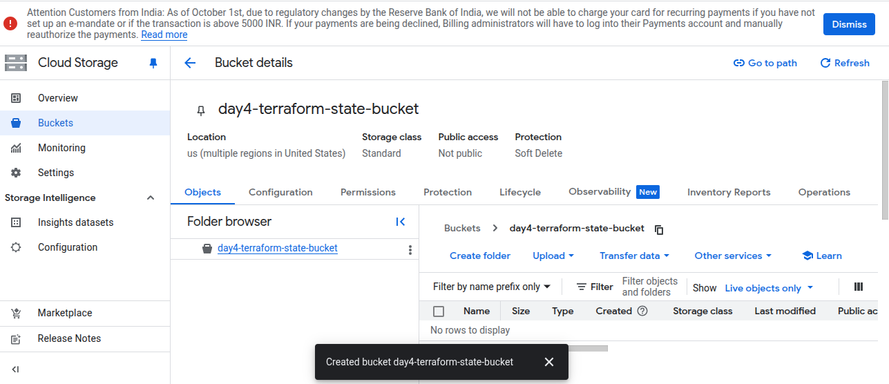
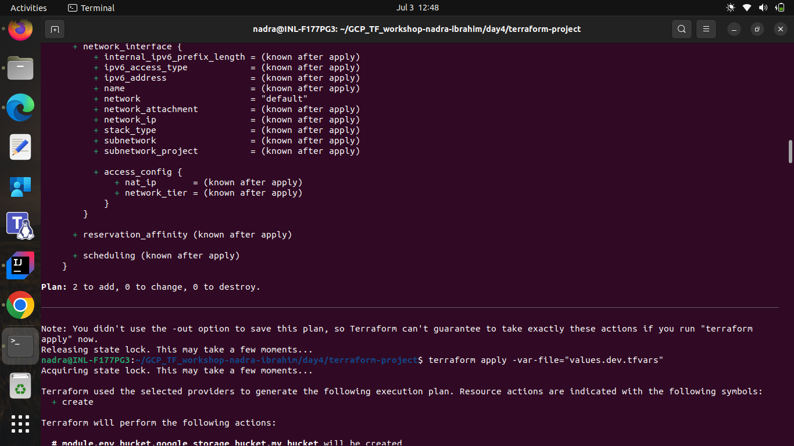
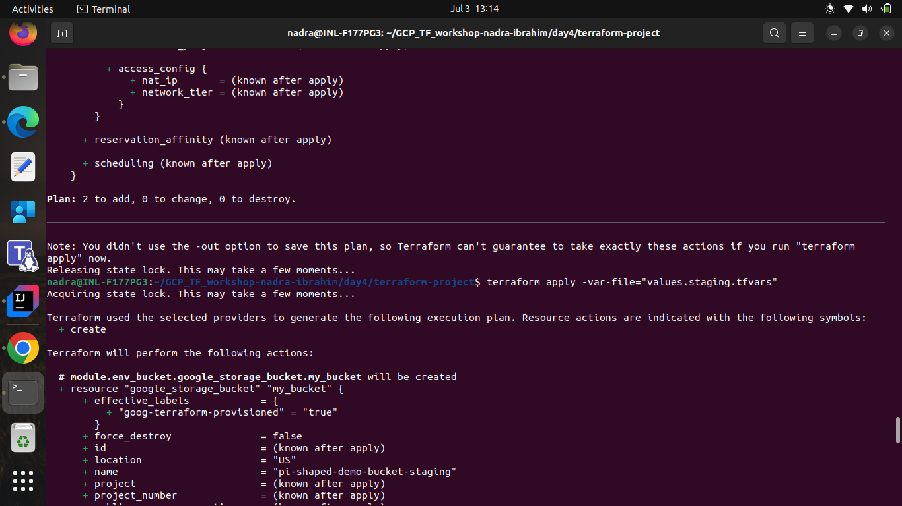

# Day 4: Advanced Terraform (Modules, Remote State, Workspaces)

## Objective
Modularize and manage Terraform configurations for scalability and collaboration.

---

## Tasks

### Task 0. Setup a Terraform project structure.
- Copied the previous day's Terraform project directory to a new directory named **terraform-project**.
- Split the **main.tf** file into two files: **provider.tf** and **resource.tf**.

---

### Task 1. Refactor previous code into a reusable module.
- Created a directory named `modules` to hold reusable Terraform modules inside the **terraform-project** directory.
- As per the previous code, there were two resources: a VM and a storage bucket. So removed the VM and storage bucket code from the root **resource.tf** file and deleted the **output.tf** file.
- Created two subdirectories: `vm` and `bucket` inside the `modules` directory.        
  
- Moved the VM configuration code into **modules/vm/vm.tf** and the output code into **modules/vm/outputs.tf**.
  ```hcl
  # modules/vm/frontend.tf
  resource "google_compute_instance" "my_vm" {
    name         = "pi-shaped-demo-vm"
    zone         = "us-central1-a"
    machine_type = "e2-medium"
  
    boot_disk {
      initialize_params {
        image = "debian-12-bookworm-v20250610"
      }
    }
  
    network_interface {
      network = "default"
      access_config {}
    }
  }
  ```
- Moved the storage bucket configuration code into **modules/bucket/bucket.tf** and the output code into **modules/bucket/outputs.tf**.
  ```hcl
  # modules/bucket/frontend.tf
  resource "google_storage_bucket" "my_bucket" {
    name         = "pi-shaped-demo-bucket"
    location     = "us"
    storage_class = "standard"
    uniform_bucket_level_access = true
  }
  ```
- Updated the root **resource.tf** file to call these modules.
  ```hcl
  module "my_vm" {
    source = "./modules/vm"
  }
  
  module "my_bucket" {
    source = "./modules/bucket"
  }
  ```
- Run `terraform init` to initialize the modules.
- Run `terraform apply` to create the resources using the modules.
  
- Checked the GCP Console to verify that the VM was created successfully.
  
- Checked the GCP Console to verify that the storage bucket was created successfully.
  

---

### Task 2. Setup backend for remote state (e.g., GCS bucket)..
- Created a GCS bucket named `day4-terraform-state-bucket` to store the Terraform state file.         
  
- Updated the **provider.tf** file to include the backend configuration for GCS.
  ```hcl
  backend "gcs" {
    bucket = "terraform-state-bucket"
  }
  ```
- Pushed the Terraform state to the remote backend using the command `terraform init -migrate-state`.
  
- Verified that the state file was successfully stored in the GCS bucket by checking the GCP Console.
  
- Ensured that the local state file is empty after migrating to the remote backend.
  

---

### Task 3. Use input variables for environment-specific configs.
- Created a **variables.tf** file in each module directory to define input variables for the resources' configurations, providing the default.                    
  
- Updated the **modules/vm/vm.tf** and **modules/bucket/bucket.tf** files to use these input variables for configurations:
  - Machine name, 
  - Machine zone, 
  - Bucket name and 
  - Bucket location.
- Updated the root's **variables.tf** to define input variables for each module, allowing for environment-specific configurations.
- Updated the module calls in the root **resource.tf** file to pass the module variables as per the environment specific variables defined in the root module's **variables.tf** file.
- Created values for the variables in a **values.staging.tfvars** file for the staging environment, ensuring that the configurations are tailored to the specific environment.
- Created a values file named **values.dev.tfvars** for the development environment, ensuring that the configurations are tailored to the specific environment.           
  
- Used the `terraform plan -var-file="values.dev.tfvars"` command to check the changes for the development environment and then applied the changes.
  
- Checked the GCP Console and:
  - Verified that the VM was created for the development environment.
    
  - Verified that the storage bucket for the development environment.
    
- Used the `terraform plan -var-file="values.staging.tfvars"` command to check the changes for the staging environment. **The plan output shows that the resources in the staging environment will be created and the resources in the development environment will be destroyed.**
  
- Applied the changes and checked the GCP Console and:
  - Verified that the VM was created for the staging environment and the VM in the development environment was destroyed.
    
  - Verified that the storage bucket was created for the staging environment and the bucket in the development environment was destroyed.
    
- This modular approach ensures that the Terraform configurations are reusable and maintainable, allowing for easy updates and changes in the future.

---

### Task 4. Create dev/staging workspaces.
- **Previously, I faced an issue where the resources created in the development environment were removed when I applied the configurations for the staging environment. This was because both environments were using the same Terraform state file, leading to conflicts and unintended deletions.To resolve this, I used Terraform workspaces to create separate environments for development and staging.**
- Created a new workspace for development and another for staging.
  ```bash
  terraform workspace new dev_workspace
  terraform workspace new staging_workspace
  ```
- Verified that the workspaces were created successfully by running `terraform workspace list`, which showed both the `dev` and `staging` workspaces.
  
- As the current workspace is `staging_workspace`, I used the `terraform plan -var-file="values.staging.tfvars"` command to check the changes for the staging environment.
  
- Applied the changes and checked the GCP Console and:
  - Verified that the VM was created for the staging environment.
    
  - Verified that the storage bucket was created for the staging environment.
    
- Switched to the development workspace to apply configurations specific to that environment.
  ```bash
  terraform workspace select dev_workspace
  ```
- Used the `terraform plan -var-file="values.dev.tfvars"` command to check the changes for the development environment. **As the state file is now isolated for each workspace, the resources in the staging environment will not be affected by changes made in the development workspace, confirmed by the plan output**
  
- Applied the changes and checked the GCP Console and:
  - Verified that the VM was created for the staging environment.
    
  - Verified that the storage bucket was created for the staging environment.
    
- This approach allows for isolated development and staging environments, preventing conflicts and ensuring that changes in one environment do not affect the other.

---

## Modularization Explanation

Modularization in Terraform involves breaking down infrastructure code into reusable components called modules. Each module encapsulates a specific piece of infrastructure like in this project:

- `/modules/vm`: Contains the configuration for a virtual machine (VM), the input variables for the machine configuration, and the output variables for the VM.
- `/modules/storagefolders`: Contains the configuration for a storage bucket, the input variables for the bucket configuration, and the output variables for the bucket.

In `resource.tf`, these modules are called with input variables to make them reusable across environments.

This approach promotes:
- Code reusability, 
- Consistency and 
- Maintainability across different environments and projects.

---

## Workspace Explanation

Terraform workspaces allow users to manage multiple instances of the same infrastructure configuration within a single Terraform project. Each workspace maintains its own state file, enabling teams to create isolated environments (e.g., development, staging, production) without needing separate directories or projects.
It also enables teams to switch contexts easily, making it straightforward to apply changes to different environments as needed. 
Like in this project, the `dev_workspace` and `staging_workspace` were created to manage the development and staging environments separately, ensuring that changes in one environment do not affect the other.
This way we had the multiple instances of the same infrastructure configuration, that is, **vm and storage bucket**, in different environments: **dev** and **staging**.

---

## Core Concept Questions

### 1. What are the advantages of using Terraform modules in a microservice-oriented product team?
Using Terraform modules in a microservice-oriented product team offers several advantages:
1. **Reusability**: Modules allow teams to encapsulate and reuse code across different projects or environments, reducing duplication and improving maintainability.
2. **Consistency**: Modules help enforce consistent infrastructure patterns and configurations across teams, ensuring that best practices are followed.
3. **Scalability**: As teams grow, modules enable them to scale their infrastructure code without becoming unwieldy, allowing for easier management of complex systems.
4. **Collaboration**: Teams can work independently on different modules, facilitating parallel development and reducing conflicts.
5. **Isolation**: Modules can encapsulate specific functionality, allowing teams to isolate changes and test them independently before integrating them into the main infrastructure.

### 2. How do workspaces simplify multi-environment deployments?
Terraform workspaces simplify multi-environment deployments by allowing teams to manage multiple instances of the same infrastructure configuration within a single Terraform project. Each workspace maintains its own state file, enabling teams to create isolated environments (e.g., development, staging, production) without needing separate directories or projects. This isolation helps prevent conflicts between environments, allows for easier testing and validation of changes, and simplifies the management of environment-specific configurations through input variables. Workspaces also enable teams to switch contexts easily, making it straightforward to apply changes to different environments as needed.

### 3. Why is storing state remotely better than keeping it local, especially in a team setup?
Storing Terraform state remotely is better than keeping it local, especially in a team setup, for several reasons:
1. **Collaboration**: Remote state allows multiple team members to work on the same infrastructure without conflicts. When state is stored locally, only one person can apply changes at a time, leading to potential issues and confusion.
2. **Consistency**: Remote state ensures that all team members are working with the same version of the state file, reducing discrepancies and ensuring that everyone has access to the latest infrastructure state.
3. **Security**: Remote state storage can be secured with access controls, encryption, and versioning, protecting sensitive information and preventing unauthorized access. Local state files may be more vulnerable to accidental deletion or exposure.
4. **Backup and Recovery**: Remote state storage often includes built-in backup and recovery mechanisms, allowing teams to restore previous states in case of errors or issues. Local state files may not have such protections, increasing the risk of data loss.
5. **Scalability**: As infrastructure grows, managing state files locally can become cumbersome. Remote state storage can handle larger state files and provide better performance for teams working with complex infrastructures.

---
