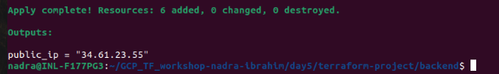
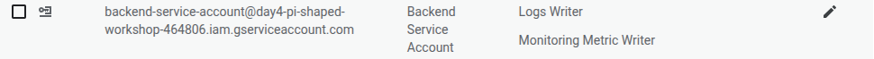

## Day 5: GCP + Terraform Use Case: Deploy a Web Application

## Objective
Deploy a 2-tier app (frontend + backend) using Terraform with optimization and best practices.

---

## Tasks

### Task 0. Create a Full Stack Web App: Guess Game
- Backend: Flask API that generates a random number and allows users to guess it.
   - Endpoint: `/guess` (POST)
     - Response: JSON with feedback on the guess (too high, too low, correct).
     - Reset game after a correct guess.
   - Endpoint: `/` (GET)
     - Response: Welcome message and instructions. 
- Frontend: Angular app that interacts with the backend API.

---

### Task 1. Use Terraform to deploy a backend API and a frontend VM (or GKE cluster)

#### Deploy the backend API on GCP compute engine
- Inside the terraform-project directory, created a new directory named `backend` to organize the Terraform code for the backend API deployment.
- Created the project structure for backend:
  - `backend.tf`: Created the **three** resources:
    1. A Google Compute Engine instance for the backend API with **metadata** for startup script to install Flask, install git, clone the repository and run the app. 
    2. A firewall rule to allow traffic to the backend API.
    3. A monitoring uptime check config to check health of the backend API to ensure it is running and accessible.
  - `service_account.tf`: Created the **three** resources:
    1. Service account for the backend VM to securely access GCP resources.
    2. IAM policy to allow **monitoring** for the backend VM.
    3. IAM policy to allow **logging** for the backend VM.
  - `variables.tf`: Define variables for project id, region, zone, VM instance type, zone, and network settings.
  - `outputs.tf`: Output the external IP of the backend VM and service account email.
  - `provider.tf`: Configure the GCP provider with the necessary credentials and project details.
- Applied the Terraform configuration to create the backend VM.
- Checked the VM instance creation on gcp console:
  

#### Deploy the frontend on GCP Bucket
- In the environment.ts in the Angular app, set the backend API URL to the external IP of the backend VM.
- Built the Angular app using `ng build --base-href ./guess-game-frontend/`.
- Inside the terraform-project directory, created a new directory named `frontend` to organize the Terraform code for the frontend deployment.
- Created the project structure for frontend:
  - `frontend.tf`: Define the frontend bucket with:
    - Bucket name and location.
    - Enable static website hosting.
    - Permissions to allow public access to the bucket.
    - Storage Object Viewers role for allUsers to allow public access.
    - Upload the Angular build files to the bucket.
  - `outputs.tf`: Output the build files pf angular project and URL of the frontend bucket.
  - `variables.tf`:  Define variables for project id, region, zone, bucket name and location.
  - `provider.tf`: Configure the GCP provider with the necessary credentials and project details.
- Applied the Terraform configuration to create the frontend bucket and upload the Angular app.
- Created Storage Bucket and Uploaded Angular Build Files successfully.
  

----

## Task 2.Configure firewall rules, health checks, and Cloud NAT if needed

### Firewall Rules
- For the backend VM created firewall rule named `allow_flask_api"` to allow incoming HTTP traffic from any IP address for the port 8080.
  

### Monitoring uptime check config
- Created a monitoring uptime check config to check the health of the backend API:
  
  - Api Uptime Check:                  
    
  - Passed Checks:
    
  - Uptime Check Latency:
    

----

## Task 3. Add output variables for URLs and IPs
- Added output variables in the `outputs.tf` files for both backend and frontend modules:
  - For the backend API, output the external IP of the backend VM and service account email.
  
  - For the frontend bucket, output the URL of the bucket and the build files of the Angular project.                     
  

----

## Task 4. Implement IAM roles and service accounts

### IAM Polcy
- Created the IAM policy for the frontend bucket to allow public access, using the `allUsers` principal to grant the `roles/storage.objectViewer` role.
  
  
### Service Account
- Created a service account for the backend VM to securely access GCP resources:
  
- Following the principle of **The Least Privilege**, assigned the necessary IAM roles to the service account to allow it to interact with GCP resources securely:
  - Monitoring and Logging:
    
- Attached the service account to the backend VM instance, by using it in the backend VM instance definition.

----

#### Task 5. Check the full stack app working
- Confirmed the backend API is running by accessing the external IP and testing the `/` endpoint.
  
- Allowed the traffic from insecure origins in the Angular app to allow the frontend to access the backend API.
- Tested the full stack app by accessing the frontend URL at the `/` endpoint.
  
- Tested the guess game functionality by making a POST request to the `/guess` endpoint with a sample guess.
  

----

## Task 6. Document Optimization (cost-effective VM types, auto-stop schedules, etc.)
- **Cost-effective VM Types**: 
  - Use smaller machine types (e.g., `e2-micro`, `e2-small`) for the backend API if the traffic is low.
  - Consider using preemptible VMs for non-critical workloads to save costs.
- **Auto-stop Schedules**:
  - Implement auto-stop schedules for the backend VM during non-peak hours to reduce costs.
  - Use Cloud Scheduler to automate the stopping and starting of the VM based on traffic patterns.
- **Storage Optimization**:
  - Use Cloud Storage for static assets and enable lifecycle management to automatically delete old versions of files.
  - Consider using regional buckets for lower latency and redundancy.
- **Monitoring and Alerts**: 
  - Set up monitoring and alerts for resource usage to identify underutilized resources.
  - Use Cloud Monitoring to track performance metrics and optimize resource allocation.

----

## Core Concept Questions

### 1. What cost optimization strategies can be applied when hosting a scalable web app in GCP?
- Use smaller machine types (e.g., `e2-micro`, `e2-small`) for low traffic applications.
- Consider using preemptible VMs for non-critical workloads to save costs.
- Implement auto-stop schedules for VMs during non-peak hours to reduce costs.
- Use Cloud Storage for static assets and enable lifecycle management to automatically delete old versions of files.
- Use regional buckets for lower latency and redundancy.
- Set up monitoring and alerts for resource usage to identify underutilized resources.
- Use Cloud Monitoring to track performance metrics and optimize resource allocation.
- Consider using autoscaling for the backend API to automatically adjust resources based on traffic patterns.

### 2. How can service accounts be used securely when multiple apps interact internally?
- Use service accounts to grant specific permissions to applications, following the principle of least privilege.
- Create separate service accounts for each application to isolate permissions and reduce the risk of unauthorized access.
- Use IAM roles to define the permissions for each service account, ensuring they only have access to the resources they need.
- Implement IAM policies to restrict access to service accounts, allowing only trusted applications to use them.
- Use service account keys securely, avoiding hardcoding them in application code. Instead, use environment variables or secret management services like Google Secret Manager.

### 3. What are best practices to build scalable, secure Terraform templates for production GCP workloads?
- **Modular Design**: Organize Terraform code into reusable modules for different components (e.g., networking, compute, storage) to promote reusability and maintainability.
- **Version Control**: Use version control systems (e.g., Git) to manage Terraform code, enabling collaboration and tracking changes.
- **State Management**: Use remote state storage (e.g., Google Cloud Storage) to manage Terraform state files securely and enable collaboration among team members.
- **Variable Management**: Use variables to parameterize configurations, allowing for flexibility and reusability across different environments (e.g., dev, staging, prod).
- **IAM and Security**: Implement IAM roles and policies to enforce the principle of least privilege, ensuring that resources are only accessible to authorized users and applications.
- **Resource Naming Conventions**: Use consistent naming conventions for resources to improve readability and manageability.
- **Documentation**: Document Terraform modules and configurations to provide clarity on their purpose and usage.

---
